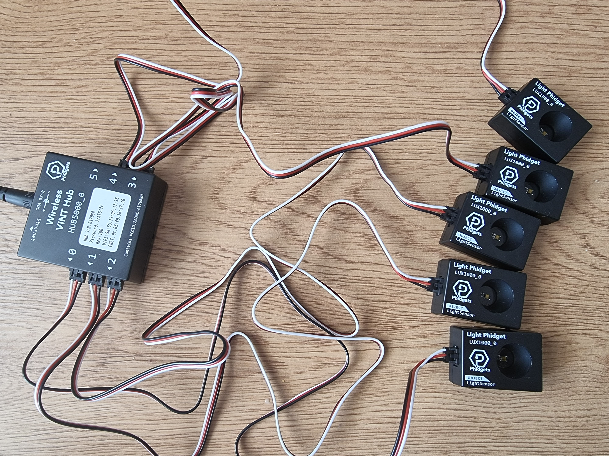

# DiMOS IoT

The DiMOS format and tooling is compatible with IoT redundancy-based scenarios, such as MMR (Multi-Module Redundancy) and sensor fusion applications.

## Sample configuration

We designed a demo configuration of 5 light sensors on a networked hub, to simulate a scenario of 5 edge nodes with 1 sensor each, submitting a measurement.

Here, the DiMOS DCC (Data-Centric Consensus) system plays the role of a traditional MMR Voter system, with the added benefits of a DiMOS-compatible modular data format for adding more sensors and nodes and a machine readable reliability report that provides insight on the trustworthiness of each sensor on each node as well as the overall trustworthiness of the output.

.png)

As with standard MMR systems, unreliable sensors are detected and the output is adjusted accordingly. These outputs and reliability insights can in turn be used by other intelligent automation systems to mark sensors that need replacing, or to control the behaviours of other connected systems.
